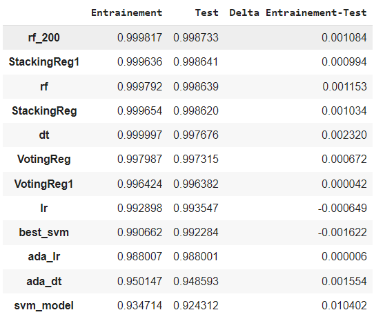
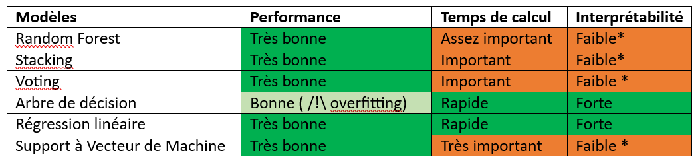

## Quelles sont les émissions de CO2 d'une voiture ?  

**Description du projet :** Nous allons nous exercer à prédire les émissions de CO2 d’un véhicule. L’idée sous-jacente est d’identifier les véhicules polluants. 

### EDA et Pre-processing**
Toutes sont présentées de façon exhaustive dans le notebook et le rapport final (Word) de ce projet. 

### Conclusion de la modélisation

Le choix du modèle est assez ouvert car les performances de tous s'équivalent.  

S’il y a plusieurs modèles parmi lesquels choisir (car les performances s’équivalent), deux critères de plus peuvent être pris en considération :
-	Temps de calcul
-	Interprétabilité des résultats retournés
Voici un rapide commentaire pour chaque modèle :

*Les modèles ne proposent pas de récupérer l’ordre d’importance des features quant à leur impact sur la sortie du label (contrairement à l’arbre de décision, la régression et le randomforest). Il faudrait utiliser des méthodes plus approfondies pour obtenir les informations d’interprétabilité (via SKATER, LIME ou SHAP).
Selon une analyse succincte, on peut retenir la régression linéaire comme étant la plus adaptée à notre problème. 

Pour une présentatino exhaustive, vous pouvez retrouver [mon rapport d'étude](https://guides.github.com/features/mastering-markdown/) et [mon notebook]([https://guides.github.com/features/mastering-markdown](https://colab.research.google.com/drive/1pqc4teWw9T0bCkp6vWxCOZl9Uv0PmzOX?usp=sharing)https://colab.research.google.com/drive/1pqc4teWw9T0bCkp6vWxCOZl9Uv0PmzOX?usp=sharing/). 
